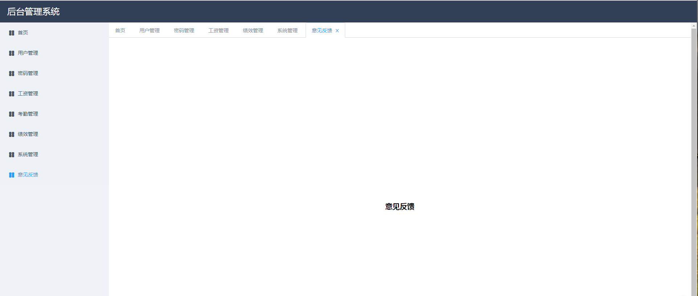

# vue-admin

基于vue、element-ui的后台管理系统demo，主要是做了动态操作tabs的实践。
效果图：



在线demo：[online display](http://www.monster1935.site/vue-admin/)

动态tabs操作的思路：

1. 设置一源数组options，该数组用于动态的渲染tabs
2. 点击左侧菜单导航栏时动态的push进options一条数据
3. 删除tabs时，动态的删除options的一条数据

其中的难点（稍有点麻烦的地方）就是和路由之间的绑定，涉及到路由绑定的有以下几个地方：

1. 点击左侧菜单栏时路由需要进行跳转
2. 切换、删除右侧tab时需要进行路由的跳转
3. 浏览器地址栏手动输入路由时进行的跳转

综上：

1. 应用进入时，即首次mounted时，应判断当前路由，根据当前路由加入tabs。目的在于刷新当前浏览器时，保证当前url对应的路由会被添加进tab。
2. 左侧菜单栏点击时，只进行路由的跳转，具体的tabs添加动作放在对$route的监听逻辑中
3. 在对$route的监听逻辑中，判断当前路由是否被添加过tabs，如果添加过，设置当前路由对应的tabs为激活的tab。如果未被添加过，则添加。
4. tabs切换时，动态切换路由
5. tabs删除时，options源数组中删除该条tabs记录，如果删除的这个tab为当前激活的tab，重新设置新的激活的tab，具体的设置激活tab的策略可以不同，该应用中采用了设置最后一个options中的记录为激活的tab。

小技巧：

在设置路由的配置项时，将路由的name项设置为了tabs对应的label，用于路由配置项和对应的tabs匹配。

# how to use
```bash

npm install

npm run dev

```
